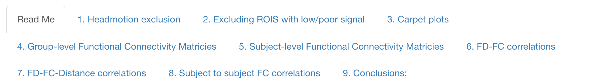
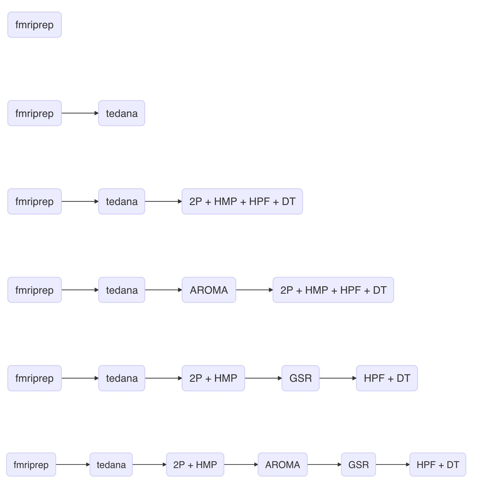

rs-fMRI Quality Control Report for NAPPY-DCM Project (Multi-echo+Multi-band Data)
================

## Reference

Orchard, E, R., Voigt, K., Chopra, S., Rana, T., Ward, P., Egan, G., Jamadar,S. (2022). [The maternal brain is more flexible and responsive at rest: effective connectivity of the parental caregiving network in postpartum mothers]([https://www.medrxiv.org/content/10.1101/2022.01.11.22268989v3](https://www.biorxiv.org/content/10.1101/2022.09.26.509524v1)).
bioRxiv.

------------------------------------------------------------------------

Rendered HTML report of data quality can be downloaded [here](https://www.dl.dropboxusercontent.com/s/dn4yz1c94bl7vj8/report_git.html?dl=0). This document can take up to 2 min to fully load. **Please wait** until nine "tabs" have appeared above this sentence before exploring the document.

The report compares multiple processing pipelines on the following metrics:

  

The following piplines are compared (please see report for more details on implementation):

  

  ------------------------------------------------------------------------

## Questions

Please contact me (Sidhant Chopra) as <sidhant.chopra@yale.edu> and/or
<sidhant.chopra4@gmail.com>
